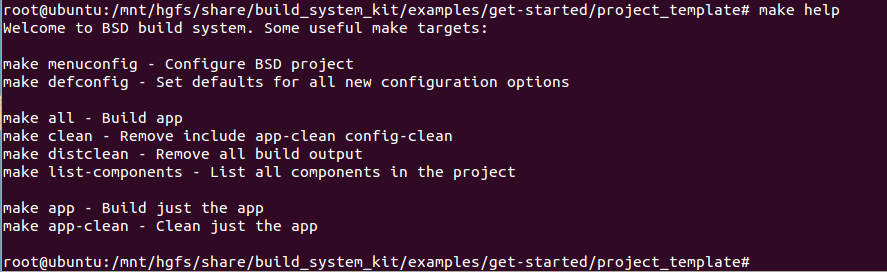
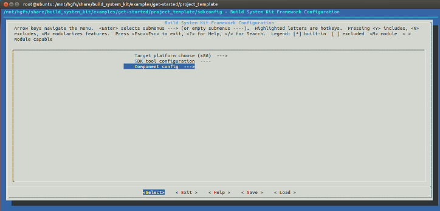

## About this repository
a build system kit embed from [esp-idf](https://github.com/espressif/esp-idf).

## 1.How to use?

	$cd build_system_kit
    $source set_bsd_environment.sh
    
    $cd PRJ_DIR
    $make menuconfig
    $./run_make.sh
   
**Use the make help for more shell cmd:**

You can create you project like the $(BSD_PATH)/examples.

Problems:
**make menuconfig cannot work?**

    $apt-get update
    $apt-get install libncurses5-dev
    
    $cd ./tools
    $./kconfig/lxdialog/check-lxdialog.sh -ccflags

The result for make menuconfig:

## 2.How to create your own projects?
The most minal project is created in the $(BSD_PATH)/examples/get-started dir called **project_template**.

**Others:**when your project is more complex and need to link third lib,you can use the var **EXTRA_LDFLAGS** to add **lib*.so or lib*.a.**

**The following var is used to include your project to build in the build_system_kit:**

- COMPONENT_ADD_LDFLAGS:  Add linker arguments to the LDFLAGS for the app executable. Defaults to -l$(COMPONENT_NAME). If adding pre-compiled libraries to this directory, add them as absolute paths - ie:
    COMPONENT_ADD_LDFLAGS += -L$(SDL_DIR_LIB)/lib -L$(FFMPEG_DIR_LIB)/lib
    COMPONENT_ADD_LDFLAGS += -lSDL2 -lavcodec -lavformat -lswresample -lavdevice -lavutil  -lswscale -lavfilter -lpostproc

- COMPONENT_ADD_INCLUDEDIRS: Paths, relative to the component directory, which will be added to the include search path for all components in the project.

- COMPONENT_SRCDIRS: Directory paths, must be relative to the component directory, which will be searched for source files (*.cpp, *.c, *.S). Defaults to '.', ie the component directory itself. Override this to specify a different list of directories which contain source files.

- CFLAGS: Include your project building flags.

 

  